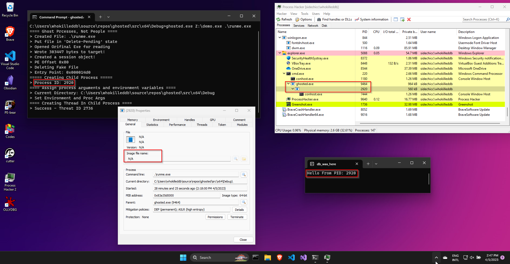
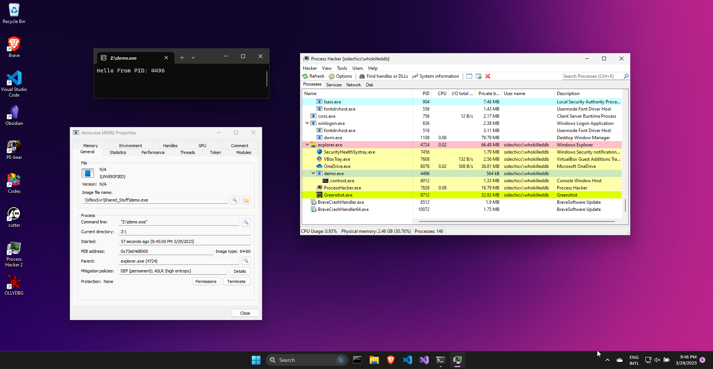
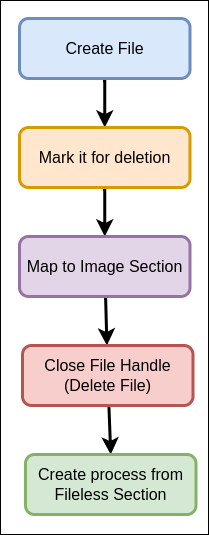
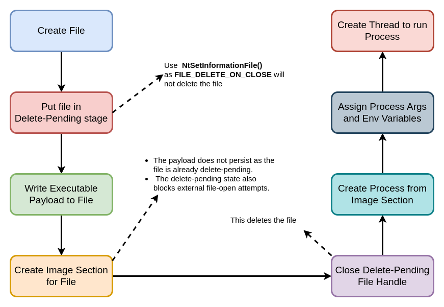

# Ghosted - A PoC on Process Ghosting

## Introduction
`Process Ghosting` is a technique of running EXE payloads that has already been deleted. On Windows. it is possible to create a file, put it in a delete pending stage, write your payload to it, map it to an image section for it, close the file handle to delete the file and then finally create a process from the mapped image section. This, essentially, is the `Process Ghosting` process.  In this way, the created process does not have an associated executable file on disk which makes detections difficult for certain EDRs/AV engines.



## Processes Spawned Up, Callbacks Get Thrown Up [🎵](https://www.youtube.com/shorts/XO5gYTHo6HI)


An interesting question to ask is how do Security vendors scan processes? One of the methods, [as described my Microsoft in this post](https://www.microsoft.com/en-us/security/blog/2022/06/30/using-process-creation-properties-to-catch-evasion-techniques/), goes as follows:

> Process creation callbacks in the kernel, such as those provided by the [_PsSetCreateProcessNotifyRoutineEx_](https://docs.microsoft.com/windows-hardware/drivers/ddi/ntddk/nf-ntddk-pssetcreateprocessnotifyroutineex) API, is the functionality in the operating system that allows antimalware engines to inspect a process while it’s being created. It can intercept the creation of a process and perform a scan on the relevant executable, all before the process runs.

However, there is a catch. Looking at the documentation for [`PsSetCreateProcessNotifyRoutineEx`](https://docs.microsoft.com/windows-hardware/drivers/ddi/ntddk/nf-ntddk-pssetcreateprocessnotifyroutineex), notice the following part:

> When a process is created, the process-notify routine runs in the context of the thread that created the new process. When a process is deleted, the process-notify routine runs in the context of the last thread to exit from the process.

This means that callbacks are registered only when the first thread is spawned, which gives malware a window between time of creation and the time at which security vendors are notified about it. It is in this interval that malware can carry out image tampering leading to attacks like `Process Doppelgänging`, `Process Herpaderping` and `Process Ghosting`.

## Processes vs Exes

First, let us write a demo application which we will use to demonstrate certain artifacts throughout:

```c
// demo.c
#include <windows.h>
#include <stdio.h>

int main() {
	printf("Hello From PID: %d\n", GetCurrentProcessId());
	getchar();
	return 0;
}
```

Compiling and running this program outputs the process's PID. Running the process and inspecting it's properties in _Process Hacker2_ shows the following:



Notice how the `demo.exe` executable is listed as the `Image File name` for the process? However, one can delete the executable and the process would still be live. Quoting Gabriel Landau here:

> It’s important to note that processes are not executables, and executables are not processes.

This [blog](https://fourcore.io/blogs/how-a-windows-process-is-created-part-2) does a good job of explaining the process creation flow carried out by [CreateProcess()](https://learn.microsoft.com/en-us/windows/win32/api/processthreadsapi/nf-processthreadsapi-createprocessa) to launch a process on Windows. Long story short, Windows uses function calls like `NtCreateUserProcess()` to launch a process, but the indiviual API components can also be called to launch a process. 

The steps to launch a process from an executable can be summarized as such:
- Open an Executable file and get a handle to it
- Create an `Image Section` for the file and map the appropriate memory
- Create a Process out of the mapped section
- Assign appropriate environment variables and process arguments
- Create a Thread to execute the process

Again, quoting  Gabriel Landau:
> Processes are launched from executables, but some of the data within the executable file is modified as it is mapped into a process. To account for these modifications, the Windows memory manager caches image sections at the time of their creation. **This means that image sections can deviate from their executable files.**

Windows provides APIs like [PsSetCreateProcessNotifyRoutineEx](https://learn.microsoft.com/en-us/windows-hardware/drivers/ddi/ntddk/nf-ntddk-pssetcreatethreadnotifyroutineex) and [PsSetCreateThreadNotifyRoutineEx](https://learn.microsoft.com/en-us/windows-hardware/drivers/ddi/ntddk/nf-ntddk-pssetcreateprocessnotifyroutineex) to receive callbacks upon creation of processes and threads. Security vendors can register callbacks using these functions and monitor processes/threads. 

However, as mentioned before, [PsSetCreateProcessNotifyRoutineEx](https://learn.microsoft.com/en-us/windows-hardware/drivers/ddi/ntddk/nf-ntddk-pssetcreatethreadnotifyroutineex) callbacks are registered only when the first thread is spawned, therefore there is a delay between the process creation time vs when the security products are notified of it, providing a window to tamper with the executable and the associated section.

## Hot Functions in your Area

There are two functions we need to take a look at -   [NtCreateProcess](http://undocumented.ntinternals.net/index.html?page=UserMode%2FUndocumented%20Functions%2FNT%20Objects%2FProcess%2FNtCreateProcess.html). 
and [PsSetCreateProcessNotifyRoutine](https://learn.microsoft.com/en-us/windows-hardware/drivers/ddi/ntddk/nf-ntddk-pssetcreateprocessnotifyroutine).

The function definition of `NtCreateProcess()` is as follows:

```c
NTSYSAPI 
NTSTATUS
NTAPI
  
NtCreateProcess(
  OUT PHANDLE           _ProcessHandle_,
  IN ACCESS_MASK        _DesiredAccess_,
  IN POBJECT_ATTRIBUTES _ObjectAttributes_ OPTIONAL,
  IN HANDLE             _ParentProcess_,
  IN BOOLEAN            _InheritObjectTable_,
  IN HANDLE             _SectionHandle_ OPTIONAL,
  IN HANDLE             _DebugPort_ OPTIONAL,
  IN HANDLE             _ExceptionPort_ OPTIONAL );
```

Note how the function takes the handle to a Secion, and not a file? This symbolizes that we don't necessarily need a file-on-disk to create a process.

Next up, look up the defintion of [PsSetCreateProcessNotifyRoutine](https://learn.microsoft.com/en-us/windows-hardware/drivers/ddi/ntddk/nf-ntddk-pssetcreateprocessnotifyroutine):

```Cpp
NTSTATUS PsSetCreateProcessNotifyRoutine( [in] PCREATE_PROCESS_NOTIFY_ROUTINE NotifyRoutine, [in] BOOLEAN Remove );
```

Again, looking up the definition of [PS_CREATE_NOTIFY_INFO](https://learn.microsoft.com/en-us/windows-hardware/drivers/ddi/ntddk/ns-ntddk-_ps_create_notify_info) structure, we get:
```c
typedef struct _PS_CREATE_NOTIFY_INFO {
  SIZE_T              Size;
  union {
    ULONG Flags;
    struct {
      ULONG FileOpenNameAvailable : 1;
      ULONG IsSubsystemProcess : 1;
      ULONG Reserved : 30;
    };
  };
  HANDLE              ParentProcessId;
  CLIENT_ID           CreatingThreadId;
  struct _FILE_OBJECT *FileObject;
  PCUNICODE_STRING    ImageFileName;
  PCUNICODE_STRING    CommandLine;
  NTSTATUS            CreationStatus;
} PS_CREATE_NOTIFY_INFO, *PPS_CREATE_NOTIFY_INFO;
```

Of interest here is the `struct _FILE_OBJECT *FileObject` field which is a pointer to the file object for the process executable file. Callback functions can use this to scan the executable on disk for malware. But what if the executable has been deleted.....?


## Boo! A Ghost! 👻

Some of the ways to delete a file include:
- Overwrite it by using the `FILE_SUPERSEDED` flag with [NtCreateFile()](https://learn.microsoft.com/en-us/windows/win32/api/winternl/nf-winternl-ntcreatefile)
- Using the `CREATE_ALWAYS` flag with [CreateFile()](https://learn.microsoft.com/en-us/windows/win32/api/fileapi/nf-fileapi-createfilew)
- Using `FILE_DELETE_ON_CLOSE` and `FILE_FLAG_DELETE_ON_CLOSE`  flag with [CreateFile()](https://learn.microsoft.com/en-us/windows/win32/api/fileapi/nf-fileapi-createfilew)
- Set the `DeleteFile` field in the [FILE_DISPOSITION_INFORMATION](https://learn.microsoft.com/en-us/windows-hardware/drivers/ddi/ntddk/ns-ntddk-_file_disposition_information) structure to `TRUE` when invoking the `FileDispositionInformation` file information class via [NtSetInformationFile()](https://learn.microsoft.com/en-us/windows-hardware/drivers/ddi/ntifs/nf-ntifs-ntsetinformationfile)

However, Windows does not like mapped executables being tampered with so it starts throwing off a bunch of errors when we attempt to open it. 

- Trying to open the file with `NtCreateFile()` with the access set to `FILE_WRITE_DATA`, or via `CreateFile()` with `FILE_DELETE_ON_CLOSE/FILE_FLAG_DELETE_ON_CLOSE` flags will result in`ERROR_SHARING_VIOLATION` 
- 'NtSetInformationFile()' fails with `STATUS_CANNOT_DELETE` even when `DELETE` access right is granted
- Trying to overwrite the file with `CREATE_ALWAYS` will result in `ACCESS_DENIED`
The interesting fact here is that these restrictions come in only when the executable is mapped into an Image Section. This mechanism allows for the following flow:



`Process Ghosting` follows a similar flow: 



## Talk is Cheap, Show me the Code!

Time to walk through the code flow for the project! The code is written in C because: 
- It helps to understand everything going on at a very fundamental level
- Because I can.

The `main()` function takes in two command line arguments:
```
Usage: ghosted.exe <REAL EXE> <FAKE EXE>
```

The `<REAL EXE>` takes in the path to an executable on disk which we want to load using `Process Ghosting` while the `<FAKE EXE>` is the path where the fake executable will be created before being deleted.

### Initial Setup

First, the program  checks the correct number of command line arguments. If the number of arguments are correct, the arguments are copied to two variables corresponding to the executable on disk and the file to be created for deletion. 

The program also makes sure that:
- The executable on disk actually existed and had `READ` permissions on it
- The executable to be created does not already exist.

If the checks pass, the program proceeds to call the `spawn_process()` function with the necessary parameters.

### Prepare Target

Next up, the we need to create the target fake file where the payload would be written with `DELETE` permission.

```c
h_tfile = CreateFileA(
	target_exe,
	DELETE | SYNCHRONIZE | FILE_GENERIC_READ | FILE_GENERIC_WRITE ,
	FILE_SHARE_READ | FILE_SHARE_WRITE,
	NULL,
	OPEN_ALWAYS,
	FILE_ATTRIBUTE_NORMAL,
	NULL
);
```

Next up, we need to put the file in `DELETE-PENDING` state. We do this via the `NtSetInformationFile()` function:

```c
IO_STATUS_BLOCK io_status;
RtlZeroMemory(&io_status, sizeof(io_status));

FILE_DISPOSITION_INFORMATION f_fileinfo;
f_fileinfo.DeleteFile = TRUE;

FILE_INFORMATION_CLASS f_info = FileDispositionInformation;

_status = NtSetInformationFile(
	h_tfile,
	&io_status,
	&f_fileinfo,
	sizeof(f_fileinfo),
	f_info);
```

This code uses the `FILE_DISPOSITION_INFORMATION` structure with the `DeleteFile` field set to `TRUE`. This deletes the file as soon as the handle to the file is closed. 

If the function is successful, the handle to the open file iis returned.

### Reading Bytes

Nex

### Fetch Sections

## References
- https://www.elastic.co/blog/process-ghosting-a-new-executable-image-tampering-attack
- https://fourcore.io/blogs/how-a-windows-process-is-created-part-1
- https://dosxuz.gitlab.io/post/processghosting/