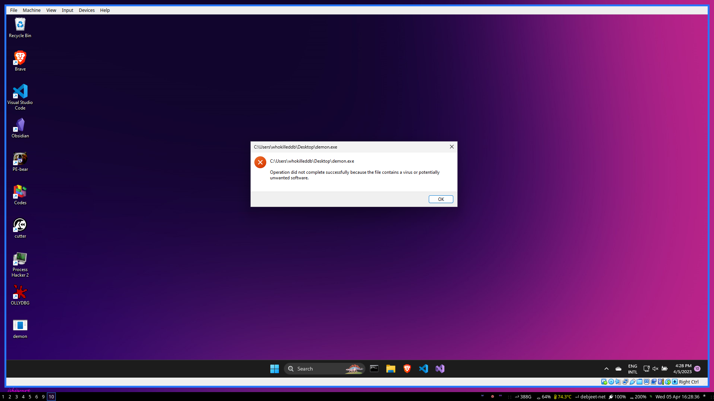
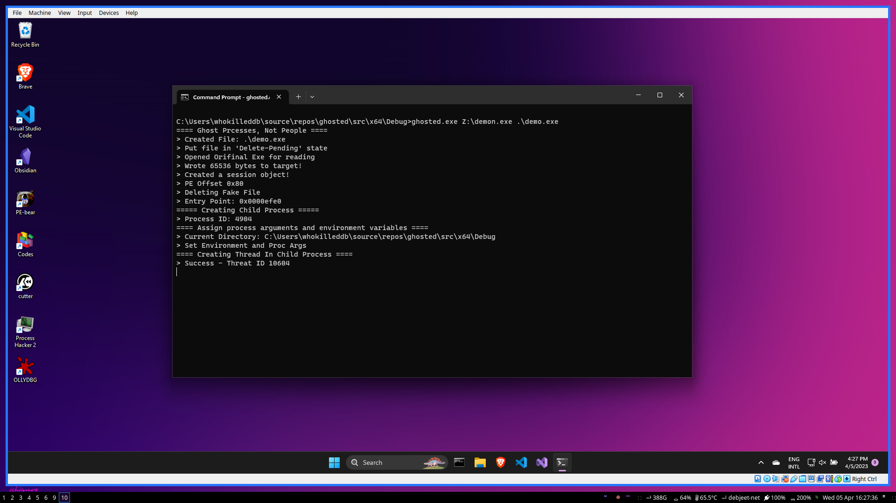
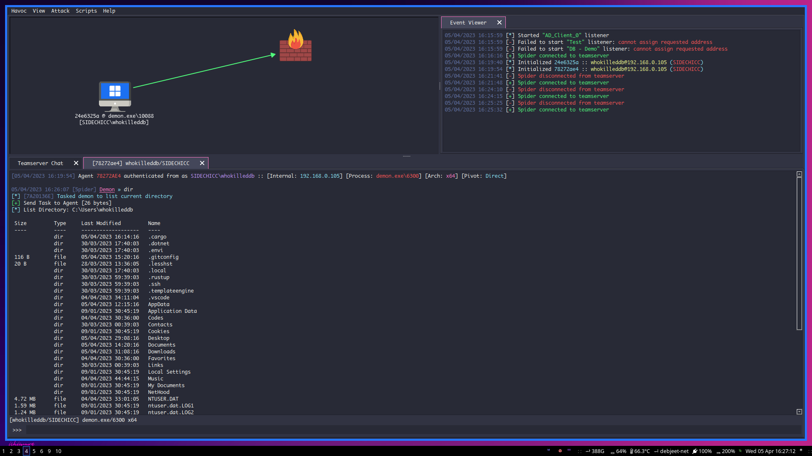

# Ghosted - A PoC for Process Ghosting!

This repository contains proof-of-concept code for Process Ghosting technique on Windows. You can find the detailed code explanation for everything happening here by reading [this blog post](https://whokilleddb.github.io/blogs/posts/process-ghosting/).

## Execution

The project can be compiled with `Visual Studio` and running it is as simple as:

```
ghosted.exe <REAL EXE> <FAKE EXE>
```

where `<REAL EXE>` parameter takes in the path to an executable to be run while `<FAKE EXE>` is the path where the transient file will be created. 

This technique can help evade EDR/AV engines as demonstrated below:

- Note how native Havoc payloads get flagged by the defender:




- However, can easily bypass this and get a reverse shell using process ghosting:



